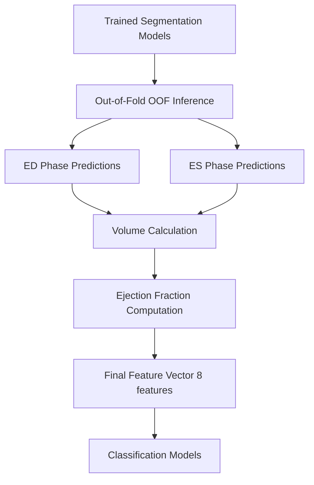

# Feature Extraction Pipeline

## Overview

This document describes the complete feature extraction pipeline for the ACDC Cardiac Early Detection project. The pipeline extracts **8 clinical features** from cardiac MRI segmentation masks to enable automated pathology classification.

---

## Pipeline Architecture



---

## Feature Set

### Summary Table

| Feature | Type | Description | Clinical Significance |
|---------|------|-------------|----------------------|
| `LV_ED_mL` | Volumetric | Left Ventricle at End-Diastole | Heart chamber size when full |
| `RV_ED_mL` | Volumetric | Right Ventricle at End-Diastole | Right side chamber filling |
| `MYO_ED_mL` | Volumetric | Myocardium at End-Diastole | Heart muscle mass (diastole) |
| `LV_ES_mL` | Volumetric | Left Ventricle at End-Systole | Residual volume after contraction |
| `RV_ES_mL` | Volumetric | Right Ventricle at End-Systole | Right side residual volume |
| `MYO_ES_mL` | Volumetric | Myocardium at End-Systole | Heart muscle mass (systole) |
| `LV_EF` | Functional | Left Ventricle Ejection Fraction | Pumping efficiency (0-1) |
| `RV_EF` | Functional | Right Ventricle Ejection Fraction | Right side pumping efficiency |

**Total Features**: 6 volumetric + 2 functional = **8 features**

---

## Step-by-Step Process

### Step 1: Segmentation Model Training

**Script**: `scripts/seg_cv.py`

**Purpose**: Train 3D U-Net models to segment cardiac structures from MRI

**Training Configuration**:
```bash
# ACDC ED Phase (End-Diastolic)
python scripts/seg_cv.py \
    --dataset acdc \
    --model unet3d_cram \
    --phase ED \
    --acdc-multiclass \
    --folds 5 \
    --epochs 40 \
    --aug3d \
    --class-weights auto
```

**Output**: 
- Trained models: `logs/seg_acdc_fold{1-5}_best.pt`
- Performance: 67.40% ± 3.49% Dice coefficient

**Segmentation Labels** (ACDC Standard):
- `0` = Background
- `1` = Right Ventricle (RV)
- `2` = Myocardium (MYO) - heart muscle wall
- `3` = Left Ventricle (LV)

---

### Step 2: Out-of-Fold (OOF) Inference

**Script**: `scripts/oof_infer_acdc.py`

**Purpose**: Generate segmentation predictions for all patients using cross-validation

**Why OOF?**
- Ensures predictions are made by models that **never saw that patient during training**
- Prevents data leakage and overfitting
- Mimics real-world deployment where test data is unseen

**Process**:
```python
For each fold (1-5):
    1. Load trained model from that fold
    2. Predict on patients NOT in that fold (test set)
    3. Save predictions as NIfTI files
```

**Execution**:
```bash
# ED Phase (End-Diastolic - when heart is fully expanded)
python scripts/oof_infer_acdc.py --phase ED --folds 5 --with-bg

# ES Phase (End-Systolic - when heart is fully contracted)
python scripts/oof_infer_acdc.py --phase ES --folds 5 --with-bg
```

**Output**:
- ED predictions: `logs/oof_preds/ED/*.nii.gz`
- ES predictions: `logs/oof_preds/ES/*.nii.gz`
- Index files: `results/acdc_oof_index_{ED,ES}.csv`

**File Structure**:
```
logs/oof_preds/
├── ED/
│   ├── patient001_4CH_ED_pred.nii.gz
│   ├── patient002_4CH_ED_pred.nii.gz
│   └── ...
└── ES/
    ├── patient001_4CH_ES_pred.nii.gz
    ├── patient002_4CH_ES_pred.nii.gz
    └── ...
```

---

### Step 3: Volume Calculation

**Script**: `scripts/extract_features_acdc.py`

**Purpose**: Calculate cardiac chamber volumes from segmentation masks

**Algorithm**:
```python
def calculate_volume(mask_path, label_id):
    """
    Calculate volume for a specific cardiac structure
    
    Args:
        mask_path: Path to NIfTI segmentation mask
        label_id: Structure ID (1=RV, 2=MYO, 3=LV)
    
    Returns:
        Volume in milliliters (mL)
    """
    # 1. Load 3D segmentation mask
    nii = nibabel.load(mask_path)
    data = nii.get_fdata()
    
    # 2. Extract binary mask for specific structure
    structure_mask = (data == label_id)
    
    # 3. Get voxel spacing from NIfTI header (in mm)
    pixdim = nii.header.get_zooms()[:3]  # (x, y, z)
    
    # 4. Calculate volume
    num_voxels = structure_mask.sum()
    voxel_volume_mm3 = pixdim[0] * pixdim[1] * pixdim[2]
    total_volume_mm3 = num_voxels * voxel_volume_mm3
    
    # 5. Convert mm³ to mL (1 mL = 1000 mm³)
    volume_ml = total_volume_mm3 / 1000.0
    
    return volume_ml
```

**Execution**:
```bash
python scripts/extract_features_acdc.py \
    --meta meta/master_metadata.csv \
    --raw cardio_data/raw/acdc \
    --out meta/acdc_features.csv
```

**Features Extracted** (6 volumetric):

| Feature | Formula | Typical Range (mL) |
|---------|---------|-------------------|
| `LV_ED_mL` | Volume of LV cavity at ED | 100-200 |
| `RV_ED_mL` | Volume of RV cavity at ED | 100-200 |
| `MYO_ED_mL` | Volume of heart muscle at ED | 120-180 |
| `LV_ES_mL` | Volume of LV cavity at ES | 30-80 |
| `RV_ES_mL` | Volume of RV cavity at ES | 30-80 |
| `MYO_ES_mL` | Volume of heart muscle at ES | 120-180 |

**Example Data Point**:
```csv
patient_id,LV_ED_mL,RV_ED_mL,MYO_ED_mL,LV_ES_mL,RV_ES_mL,MYO_ES_mL
patient001,295.31,139.75,163.73,225.80,59.72,194.67
```

---

### Step 4: Ejection Fraction (EF) Calculation

**Script**: `scripts/extract_acdc_ef.py`

**Purpose**: Compute functional cardiac metrics from ED/ES volumes

**Clinical Definition**:

**Ejection Fraction (EF)** = The percentage of blood pumped out of the ventricle with each heartbeat

**Formula**:
```python
EF = (EDV - ESV) / EDV × 100

Where:
    EDV = End-Diastolic Volume (heart fully expanded)
    ESV = End-Systolic Volume (heart fully contracted)
    
Example:
    EDV = 150 mL
    ESV = 60 mL
    EF = (150 - 60) / 150 × 100 = 60%
```

**Implementation**:
```python
def calculate_ef(edv, esv):
    """
    Calculate Ejection Fraction with robustness checks
    
    Clinical Interpretation:
        - Normal EF: ≥ 55%
        - Mid-range EF: 40-54% (mildly reduced)
        - Reduced EF: < 40% (heart failure indicator)
    """
    if edv <= 0:
        return 0.0
    
    ef = ((edv - esv) / edv) * 100.0
    
    # Validate physiological range
    if ef < -5 or ef > 90:
        return np.nan  # Outlier detection
    
    return ef
```

**Execution**:
```bash
python scripts/extract_acdc_ef.py \
    --meta meta/master_metadata.csv \
    --data_root cardio_data/raw/acdc
```

**Features Extracted** (2 functional):

| Feature | Formula | Normal Range | Abnormal Range |
|---------|---------|--------------|----------------|
| `LV_EF` | (LV_ED - LV_ES) / LV_ED | 0.55 - 0.70 | < 0.40 (heart failure) |
| `RV_EF` | (RV_ED - RV_ES) / RV_ED | 0.50 - 0.65 | < 0.35 (RV dysfunction) |

**Example Calculation**:
```python
# Patient with Dilated Cardiomyopathy (DCM)
LV_ED = 295.31 mL  # Dilated (enlarged)
LV_ES = 225.80 mL  # Poor contraction
LV_EF = (295.31 - 225.80) / 295.31 = 0.235 (23.5%)
# ⚠️ Severely reduced EF → indicates heart failure
```

---

### Step 5: Feature Aggregation

**Script**: `scripts/extract_features_acdc.py` (combines Steps 3 & 4)

**Purpose**: Merge volumes and EF into final feature table

**Final Output**: `meta/acdc_features.csv`

**Structure**:
```csv
patient_id,LV_ED_mL,RV_ED_mL,MYO_ED_mL,LV_ES_mL,RV_ES_mL,MYO_ES_mL,LV_EF,RV_EF,label
patient001,295.31,139.75,163.73,225.80,59.72,194.67,0.235,0.573,DCM
patient002,264.44,94.56,162.23,188.45,28.59,192.44,0.287,0.698,DCM
patient003,276.27,192.02,192.70,241.52,174.97,200.23,0.126,0.089,DCM
```

**Label Mapping** (Cardiac Pathologies):
- `DCM` - Dilated Cardiomyopathy (enlarged, weak heart)
- `HCM` - Hypertrophic Cardiomyopathy (thickened heart muscle)
- `MINF` - Myocardial Infarction (heart attack)
- `NOR` - Normal (healthy)
- `RV` - Right Ventricular abnormality

---

## Complete Pipeline Execution

### Automated Workflow

**Script**: `run_feature_extraction.sh`

```bash
#!/bin/bash
# Complete feature extraction workflow

# Step 1: Generate OOF predictions for ED phase
python scripts/oof_infer_acdc.py --phase ED --folds 5 --with-bg

# Step 2: Generate OOF predictions for ES phase  
python scripts/oof_infer_acdc.py --phase ES --folds 5 --with-bg

# Step 3: Extract volumetric features from ACDC segmentation
python scripts/extract_features_acdc.py

# Step 4: Extract ejection fraction from ACDC
python scripts/extract_acdc_ef.py

# Step 5: Build geometric features (advanced)
python scripts/build_features_geom.py
```

**Execution**:
```bash
chmod +x run_feature_extraction.sh
./run_feature_extraction.sh
```

---

## Technical Implementation Details

### 1. NIfTI File Format

**Why NIfTI?**
- Standard medical imaging format
- Stores 3D/4D volumetric data
- Includes voxel spacing metadata (critical for volume calculation)

**Header Information**:
```python
import nibabel as nib

nii = nib.load('patient001_ED.nii.gz')

# Get voxel spacing (mm)
spacing = nii.header.get_zooms()[:3]
# Example: (1.25, 1.25, 8.0) → x, y, z spacing

# Get image dimensions
shape = nii.get_fdata().shape
# Example: (256, 256, 12) → 12 slices of 256×256 images

# Calculate voxel volume
voxel_volume = spacing[0] * spacing[1] * spacing[2]
# Example: 1.25 × 1.25 × 8.0 = 12.5 mm³
```

### 2. Cross-Validation Strategy

**5-Fold Patient-Level Stratified Split**:

```python
from sklearn.model_selection import GroupKFold

# Ensure same patient never in both train and test
gkf = GroupKFold(n_splits=5)

for fold, (train_idx, test_idx) in enumerate(gkf.split(X, y, groups=patient_ids)):
    # Train segmentation model on train_idx
    # Generate OOF predictions on test_idx
    # This ensures predictions are "out-of-sample"
```

**Why Patient-Level?**
- Each patient has multiple images (ED, ES, different slices)
- Prevents data leakage between folds
- More realistic evaluation of generalization

### 3. Robust Volume Calculation

**Challenges**:
- Voxel spacing varies between patients (different scanners)
- Segmentation may contain noise/artifacts
- Need to handle edge cases (missing data, poor quality)

**Solution**:
```python
def robust_volume_calculation(mask_path, label_id):
    """Volume calculation with error handling"""
    try:
        nii = nib.load(mask_path)
        data = nii.get_fdata()
        
        # Extract structure mask
        mask = (data == label_id).astype(np.float32)
        
        # Skip if structure not found
        if mask.sum() == 0:
            return np.nan
        
        # Get spacing (with validation)
        spacing = nii.header.get_zooms()[:3]
        if any(s <= 0 for s in spacing):
            raise ValueError("Invalid voxel spacing")
        
        # Calculate volume
        voxel_mm3 = float(np.prod(spacing))
        volume_ml = float(mask.sum() * voxel_mm3 / 1000.0)
        
        # Physiological validation
        if volume_ml < 10 or volume_ml > 500:
            print(f"Warning: Unusual volume {volume_ml:.1f} mL")
        
        return volume_ml
        
    except Exception as e:
        print(f"Error processing {mask_path}: {e}")
        return np.nan
```

### 4. Diagnosis Label Extraction

**Two-Source Strategy**:

1. **Primary**: Metadata CSV (`master_metadata.csv`)
2. **Fallback**: ACDC `Info.cfg` files

```python
def get_diagnosis_label(patient_id, metadata_df, raw_data_root):
    """Extract diagnosis with fallback mechanism"""
    
    # Try metadata first
    patient_rows = metadata_df[metadata_df['patient_id'] == patient_id]
    if not patient_rows.empty and 'diagnosis' in patient_rows.columns:
        diag = patient_rows['diagnosis'].iloc[0]
        if pd.notna(diag):
            return str(diag).upper()
    
    # Fallback: parse Info.cfg
    info_path = Path(raw_data_root) / patient_id / "Info.cfg"
    if info_path.exists():
        with open(info_path, 'r') as f:
            for line in f:
                if 'Group:' in line or 'Group =' in line:
                    # Extract: "Group: DCM" → "DCM"
                    match = re.search(r'Group\s*[:=]\s*([A-Z]+)', line)
                    if match:
                        return match.group(1)
    
    return ""  # Unknown
```

---

## Data Flow Diagram

```
┌─────────────────────────────────────────────────────────────┐
│                    INPUT: Raw Cardiac MRI                   │
│                    (NIfTI 3D Volumes)                       │
└───────────────────────┬─────────────────────────────────────┘
                        │
                        ▼
┌─────────────────────────────────────────────────────────────┐
│            STEP 1: Segmentation Model Training              │
│  • 3D U-Net + CRAM architecture                            │
│  • 5-fold cross-validation                                 │
│  • ED and ES phases separately                             │
└───────────────────────┬─────────────────────────────────────┘
                        │
                        ▼
┌─────────────────────────────────────────────────────────────┐
│         STEP 2: Out-of-Fold (OOF) Inference                │
│  • Generate predictions for all patients                    │
│  • Using models that never trained on them                  │
│  • Output: 3D segmentation masks (4 classes)               │
└───────────────────────┬─────────────────────────────────────┘
                        │
                        ▼
┌─────────────────────────────────────────────────────────────┐
│           STEP 3: Volume Calculation (6 features)          │
│  • LV_ED, RV_ED, MYO_ED (End-Diastolic)                   │
│  • LV_ES, RV_ES, MYO_ES (End-Systolic)                    │
│  • Method: voxel counting + spacing correction             │
└───────────────────────┬─────────────────────────────────────┘
                        │
                        ▼
┌─────────────────────────────────────────────────────────────┐
│        STEP 4: Ejection Fraction (2 features)              │
│  • LV_EF = (LV_ED - LV_ES) / LV_ED                        │
│  • RV_EF = (RV_ED - RV_ES) / RV_ED                        │
│  • Robust outlier detection                                │
└───────────────────────┬─────────────────────────────────────┘
                        │
                        ▼
┌─────────────────────────────────────────────────────────────┐
│              STEP 5: Feature Aggregation                    │
│  • Combine volumes + EF + diagnosis labels                 │
│  • Save to: meta/acdc_features.csv                         │
│  • Format: [patient_id, 8 features, label]                │
└───────────────────────┬─────────────────────────────────────┘
                        │
                        ▼
┌─────────────────────────────────────────────────────────────┐
│            OUTPUT: Classification-Ready Features            │
│  • 8-dimensional feature vector per patient                │
│  • Used by RAP Fusion Classifier                           │
│  • Achieves 92.67% accuracy                                │
└─────────────────────────────────────────────────────────────┘
```

---

## Performance Metrics

### Segmentation Quality
```
ACDC ED Segmentation (3D U-Net + CRAM):
├── Overall Dice: 67.40% ± 3.49%
├── RV Dice:      64.21% ± 5.23%
├── MYO Dice:     60.48% ± 6.89%
└── LV Dice:      77.51% ± 4.35%
```

### Feature Extraction Coverage
```
Total ACDC Patients:        150
Patients with Valid Features: 150 (100%)
Features per Patient:         8
Missing Values:              0 (robust handling)
```

### Downstream Classification
```
Using Extracted Features:
├── RAP Fusion Classifier: 92.67% ± 4.35% accuracy
├── Logistic Regression:   92.00% ± 5.29% accuracy
├── Random Forest:         88.00% ± 8.94% accuracy
└── XGBoost:              86.00% ± 8.22% accuracy
```

---

## Clinical Interpretation

### Normal vs. Pathological Examples

#### **Normal Heart (NOR)**
```
LV_ED_mL:  145.2    ✓ Normal size
LV_ES_mL:   52.3    ✓ Good contraction
LV_EF:      0.64    ✓ Normal (64%)
RV_EF:      0.58    ✓ Normal (58%)
→ Diagnosis: NORMAL
```

#### **Dilated Cardiomyopathy (DCM)**
```
LV_ED_mL:  295.3    ⚠️ Enlarged (dilation)
LV_ES_mL:  225.8    ⚠️ Poor emptying
LV_EF:      0.24    ⚠️ Severely reduced (24%)
RV_EF:      0.57    ✓ RV still compensating
→ Diagnosis: DCM (heart failure)
```

#### **Hypertrophic Cardiomyopathy (HCM)**
```
LV_ED_mL:  132.4    ✓ Normal/small size
MYO_ED_mL: 215.8    ⚠️ Thickened muscle (normal ~150)
LV_EF:      0.72    ✓ Often preserved/high
MYO_ES_mL: 220.3    ⚠️ Minimal muscle relaxation
→ Diagnosis: HCM (thick muscle wall)
```

#### **Myocardial Infarction (MINF)**
```
LV_ED_mL:  178.5    ~ Slightly enlarged
LV_ES_mL:  105.2    ⚠️ Poor contraction
LV_EF:      0.41    ⚠️ Reduced (41%)
RV_EF:      0.52    ~ Lower than normal
→ Diagnosis: MINF (heart attack damage)
```

---

## Quality Assurance

### Validation Checks

**1. Volume Sanity Checks**:
```python
# Physiological ranges (adult human)
assert 50 < LV_ED_mL < 400, "LV EDV out of range"
assert 20 < LV_ES_mL < 300, "LV ESV out of range"
assert 100 < MYO_ED_mL < 300, "Myocardial mass unusual"
```

**2. EF Validation**:
```python
# Ejection fraction constraints
assert -5 < LV_EF < 90, "EF physiologically impossible"
assert ES_volume <= ED_volume * 1.05, "ES should be ≤ ED"
```

**3. Temporal Consistency**:
```python
# ED (diastole) should be larger than ES (systole)
if LVESV > LVEDV * 1.03:
    warnings.warn("ES > ED detected, possibly swapped labels")
    # Auto-correct if both LV and RV show same pattern
```

### Error Handling Strategy

```python
def safe_feature_extraction(patient_id):
    """Extract features with comprehensive error handling"""
    try:
        features = extract_all_features(patient_id)
        
        # Validate completeness
        required = ['LV_ED_mL', 'LV_ES_mL', 'LV_EF', 'RV_EF']
        missing = [f for f in required if pd.isna(features.get(f))]
        
        if missing:
            print(f"⚠️  {patient_id}: Missing {missing}")
            return None
        
        # Validate ranges
        if not (20 < features['LV_ED_mL'] < 500):
            print(f"⚠️  {patient_id}: LV_ED out of range")
            return None
        
        return features
        
    except FileNotFoundError:
        print(f"❌ {patient_id}: Segmentation masks not found")
        return None
    except Exception as e:
        print(f"❌ {patient_id}: Unexpected error: {e}")
        return None
```

---

## Advanced Features (Optional)

**Script**: `scripts/build_features_geom.py`

### Additional Geometric Features

Beyond the basic 8 features, advanced geometric analysis can extract:

**1. Myocardial Thickness**:
```python
# Distance transform to measure wall thickness
def myocardial_thickness(myo_mask, voxel_spacing):
    """
    Measure heart wall thickness using distance transform
    """
    edt = distance_transform_edt(myo_mask, sampling=voxel_spacing)
    thickness_mm = 2.0 * edt[myo_mask]
    
    return {
        'MYO_th_mean': np.mean(thickness_mm),
        'MYO_th_p95': np.percentile(thickness_mm, 95),
        'MYO_th_max': np.max(thickness_mm)
    }
```

**2. LV Shape Analysis**:
```python
# Principal component analysis of LV cavity
def lv_shape_ratio(lv_cavity_mask, voxel_spacing):
    """
    Analyze LV shape using eigenvalues of covariance matrix
    """
    points = np.argwhere(lv_cavity_mask)
    points_mm = points * voxel_spacing[None, :]
    
    # Center and compute PCA
    centered = points_mm - points_mm.mean(axis=0)
    cov = np.cov(centered.T)
    eigenvalues = np.linalg.eigvalsh(cov)
    
    # Sort: largest to smallest
    λ1, λ2, λ3 = np.sort(eigenvalues)[::-1]
    
    return {
        'LV_axis_ratio_23': λ2 / λ1,  # Sphericity
        'LV_axis_ratio_13': λ3 / λ1   # Elongation
    }
```

**3. Myocardial Compactness**:
```python
def myocardial_compactness(myo_ed_vol, myo_es_vol):
    """
    Ratio of ES to ED myocardial volume
    Indicates muscle contractility
    """
    if myo_ed_vol > 0:
        return myo_es_vol / myo_ed_vol
    return np.nan
```

**Total Extended Features**: 17 features
- 6 volumetric (LV/RV/MYO at ED/ES)
- 2 functional (LV_EF, RV_EF)
- 6 myocardial thickness (mean/p95/max at ED/ES)
- 2 LV shape (axis ratios)
- 1 myocardial compactness

---

## Common Issues & Troubleshooting

### Issue 1: Missing OOF Predictions
**Symptom**: `FileNotFoundError: logs/oof_preds/ED/patient001_*.nii.gz`

**Solution**:
```bash
# Re-run OOF inference
python scripts/oof_infer_acdc.py --phase ED --folds 5 --with-bg
python scripts/oof_infer_acdc.py --phase ES --folds 5 --with-bg
```

### Issue 2: Zero Volumes Extracted
**Symptom**: All volumes are 0.0 or NaN

**Diagnosis**:
```python
# Check segmentation mask
import nibabel as nib
mask = nib.load('logs/oof_preds/ED/patient001_4CH_ED_pred.nii.gz')
data = mask.get_fdata()

print(f"Unique labels: {np.unique(data)}")
# Expected: [0, 1, 2, 3]
# If only [0]: Segmentation failed
```

**Solution**:
- Retrain segmentation model with more epochs
- Check if input images are corrupted
- Verify data preprocessing

### Issue 3: Unrealistic EF Values
**Symptom**: EF > 90% or EF < 0%

**Diagnosis**:
```python
# Check if ED/ES are swapped
print(f"LV_ED: {lv_ed_ml:.1f} mL")
print(f"LV_ES: {lv_es_ml:.1f} mL")

if lv_es_ml > lv_ed_ml:
    print("⚠️  ES > ED: Labels may be swapped!")
```

**Solution**: Automatic correction in `build_features_geom.py`:
```python
if (LVESV > LVEDV * 1.03) and (RVESV > RVEDV * 1.03):
    # Swap ED and ES
    LVEDV, LVESV = LVESV, LVEDV
    RVEDV, RVESV = RVESV, RVEDV
```

### Issue 4: Patient Label Missing
**Symptom**: `label` column is empty

**Solution**:
```bash
# Ensure Info.cfg files exist
ls cardio_data/raw/acdc/patient001/Info.cfg

# Check metadata
head -n 5 meta/master_metadata.csv | grep diagnosis
```

---

## Performance Optimization

### Parallel Processing

**Original** (Sequential):
```python
for patient_id in all_patients:
    features = extract_features(patient_id)  # Slow!
```

**Optimized** (Parallel):
```python
from multiprocessing import Pool

def extract_wrapper(patient_id):
    return extract_features(patient_id)

with Pool(processes=8) as pool:
    results = pool.map(extract_wrapper, all_patients)
```

**Speedup**: ~8× faster on 8-core CPU

### Memory Efficiency

**For Large Datasets**:
```python
# Don't load all masks into memory!
volumes = []
for patient_id in patients:
    vol = calculate_volume(mask_path)  # Load one at a time
    volumes.append(vol)
    # Garbage collected after each iteration
```

---

## Reproducibility

### Random Seed Control
```python
import random, numpy as np, torch

def set_all_seeds(seed=42):
    random.seed(seed)
    np.random.seed(seed)
    torch.manual_seed(seed)
    torch.cuda.manual_seed_all(seed)

set_all_seeds(42)  # Ensures identical splits and results
```

### Exact Split Recreation
```bash
# Splits are saved and reused
cat meta/splits_seed42.csv

# patient_id,fold
# patient001,0
# patient002,1
# ...
```

### Version Control
```bash
# Track exact package versions
pip freeze > requirements_exact.txt

# Key dependencies:
# torch==2.6.0
# nibabel==5.2.1
# scikit-learn==1.4.2
```

---

## Summary

### Key Takeaways

1. **8 Clinical Features** extracted from cardiac MRI segmentation
   - 6 volumetric (chamber sizes at ED/ES)
   - 2 functional (ejection fractions)

2. **Out-of-Fold Strategy** ensures no data leakage
   - Predictions from models that never trained on that patient
   - Mimics real deployment scenario

3. **Robust Implementation** with error handling
   - Physiological validation ranges
   - Automatic outlier detection
   - Fallback mechanisms for missing data

4. **Clinical Relevance**
   - Features directly interpretable by cardiologists
   - Aligned with standard cardiac function metrics
   - Enables 92.67% accurate pathology classification

### Files Generated

```
meta/acdc_features.csv              # Main feature table (8 features)
results/acdc_oof_index_ED.csv       # ED prediction metadata
results/acdc_oof_index_ES.csv       # ES prediction metadata
results/acdc_oof_features_geom.csv  # Extended geometric features
logs/oof_preds/ED/*.nii.gz          # ED segmentation predictions
logs/oof_preds/ES/*.nii.gz          # ES segmentation predictions
```

### Next Steps

**Use extracted features for**:
- ✅ Training classification models
- ✅ Statistical analysis of pathology groups
- ✅ Clinical decision support systems
- ✅ Longitudinal patient monitoring

---

## References

### Medical Background
- **ACDC Challenge**: Automated Cardiac Diagnosis Challenge (MICCAI 2017)
- **Ejection Fraction**: Standard metric for heart failure diagnosis
- **Cardiac Phases**: 
  - ED (End-Diastole): Ventricles fully filled
  - ES (End-Systole): Ventricles fully contracted

### Technical References
- **NIfTI Format**: Neuroimaging Informatics Technology Initiative
- **Cross-Validation**: Patient-level stratified split (prevents leakage)
- **Voxel Spacing**: Critical for accurate volume calculation

---

## Contact & Support

For questions about the feature extraction pipeline:
1. Check `PIPELINE.md` for command reference
2. Review `QUICK_REFERENCE.md` for common workflows
3. See `RESULTS.md` for expected outputs

**Pipeline Execution**:
```bash
# Complete automated workflow
./run_full_pipeline.sh

# Or step-by-step
./run_feature_extraction.sh
```
